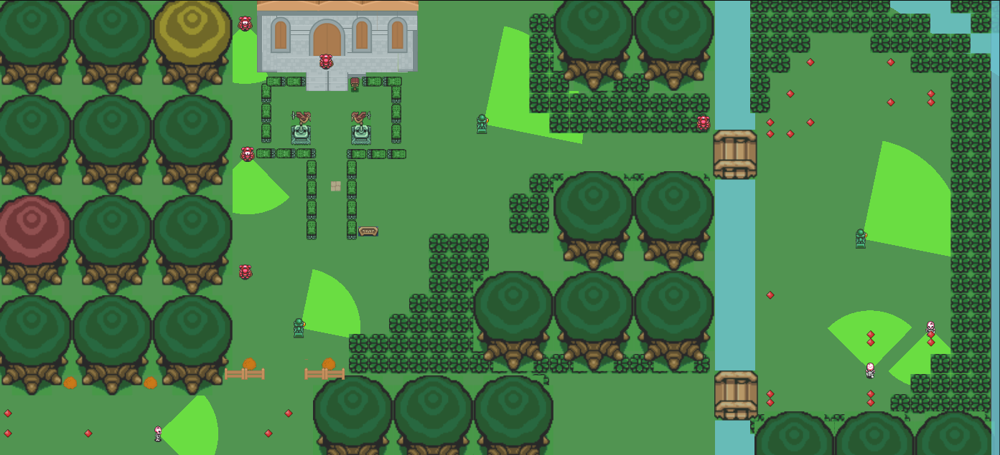
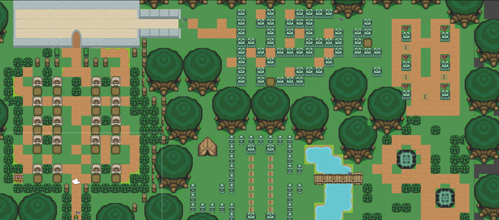

# Esu
This is a puzzle/stealth 2D top-down game developed by a group of 3 students for a university class. Done in Unity 2018.2 and updated to 2020.3. The first stage of the game have focus on the stealth mechanics, so don't let enemies see you(**it's game over if it happens**). There is a second stage with some puzzle mechanics so you'll need to work out some paths till you find the right one. The game objective is to pass through the stage and find the safe tent.

**Stage 01:** 

**Stage 02:** 

